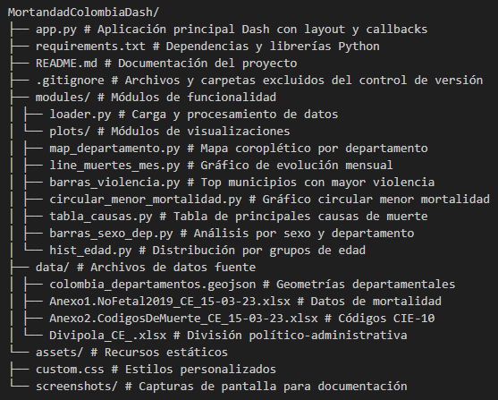
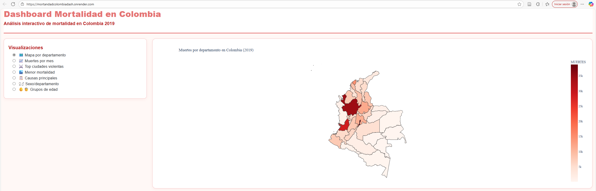
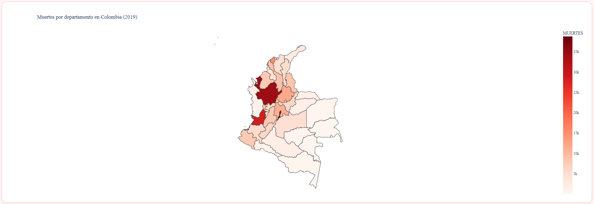
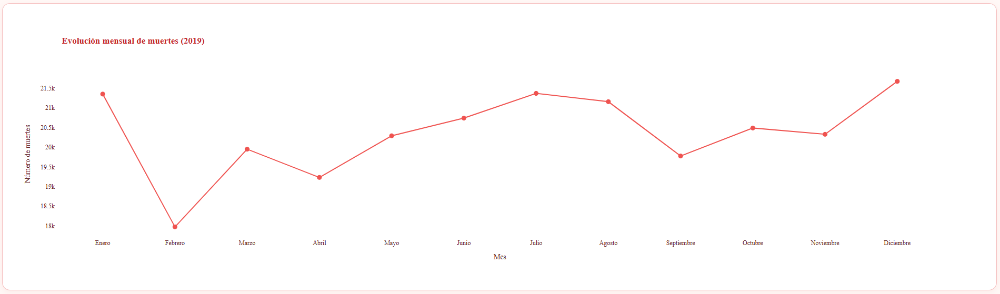
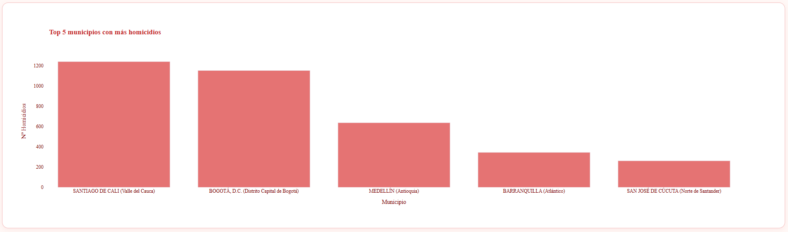
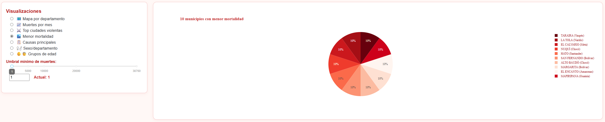
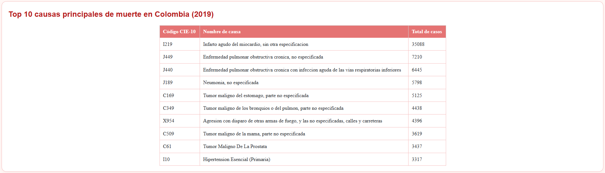
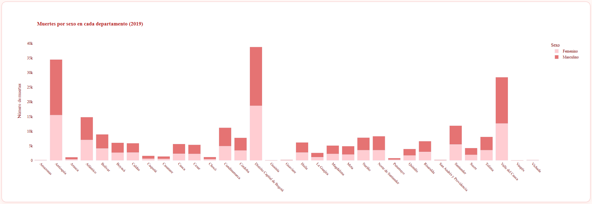
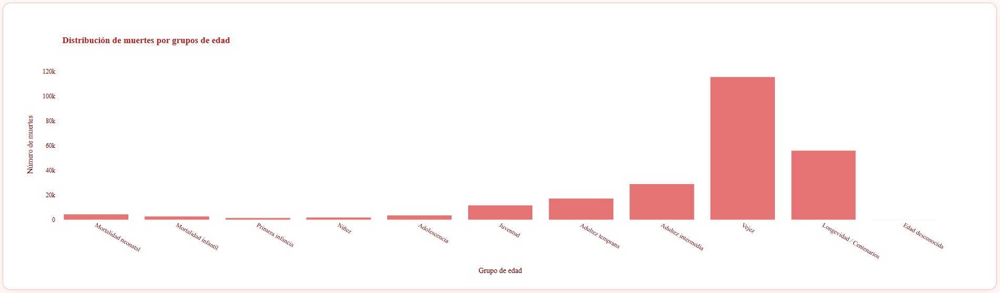

# Dashboard Mortalidad en Colombia (2019)

**Autor:** Hugo Armando Galeano Valbuena
**Aplicación web:** [https://mortandadcolombiadash.onrender.com/](https://mortandadcolombiadash.onrender.com/)  
**Repositorio GitHub:** [https://github.com/HugoGaleano/MortandadColombiaDash](https://github.com/HugoGaleano/MortandadColombiaDash)

## Introducción

Este proyecto presenta un dashboard interactivo para la exploración y análisis de las causas y patrones de mortalidad en Colombia durante el año 2019. Utiliza fuentes oficiales del DANE y datos públicos para brindar visualizaciones claras y comparativas que permiten identificar tendencias, particularidades y desigualdades a nivel departamental y municipal.

El dashboard está disponible públicamente en Render:
[https://mortandadcolombiadash.onrender.com/](https://mortandadcolombiadash.onrender.com/)

## Objetivo

El propósito de la aplicación es facilitar el análisis exploratorio de la mortalidad en Colombia, respondiendo preguntas clave como:
- ¿Cómo se distribuyen las muertes en los diferentes departamentos y municipios?
- ¿Cuáles son las principales causas de mortalidad en el país?
- ¿Existen diferencias significativas entre géneros, grupos de edad y regiones?
- ¿Qué municipios presentan las tasas más altas o bajas de violencia?
- ¿Qué patrones de mortalidad destacan por edad y sexo?

La plataforma permite a investigadores, estudiantes y tomadores de decisión visualizar los datos, identificar hallazgos y obtener información relevante de manera intuitiva y profesional.

## Estructura del Proyecto

El proyecto está organizado siguiendo una arquitectura modular para facilitar el mantenimiento y escalabilidad del código:

### Descripción de componentes principales

- **`app.py`**: Archivo principal que contiene la aplicación Dash, define el layout responsivo y maneja todos los callbacks para la interactividad.
- **`modules/loader.py`**: Centraliza la carga y preprocesamiento de todos los datasets, incluyendo limpieza, transformaciones y joins necesarios.
- **`modules/plots/`**: Módulos independientes para cada visualización, siguiendo el patrón de diseño modular para facilitar mantenimiento.
- **`data/`**: Contiene los archivos fuente oficiales del DANE y archivos complementarios en formatos Excel y GeoJSON.
- **`assets/`**: Recursos estáticos como hojas de estilo CSS personalizadas y capturas de pantalla para documentación.

## Requisitos

Para ejecutar la aplicación se requieren las siguientes librerías (consultar `requirements.txt` para versiones exactas):

- Python >= 3.10
- dash==3.2.0
- dash-bootstrap-components==2.0.4
- pandas==2.3.3
- plotly==6.3.1
- openpyxl==3.1.5
- numpy==2.3.4
- Flask==3.1.2
- gunicorn         # Solo necesario para despliegue en Render (producción)
- Otros paquetes complementarios:
  - blinker
  - certifi
  - charset-normalizer
  - click
  - colorama
  - et_xmlfile
  - idna
  - importlib_metadata
  - itsdangerous
  - Jinja2
  - MarkupSafe
  - narwhals
  - nest-asyncio
  - packaging
  - python-dateutil
  - pytz
  - requests
  - retrying
  - setuptools
  - six
  - typing_extensions
  - tzdata
  - urllib3
  - Werkzeug
  - zipp

**Instalación recomendada:**  
Utilizar el comando:

pip install -r requirements.txt

para instalar todas las dependencias automáticamente.

## Software Utilizado

El desarrollo y despliegue de la aplicación utiliza los siguientes componentes:

- **Python**: Lenguaje principal para desarrollo y procesamiento de datos.
- **Dash**: Framework para la creación de aplicaciones web interactivas y visualizaciones en tiempo real.
- **Dash Bootstrap Components**: Implementación de componentes de estilo Bootstrap para mejorar la experiencia visual y responsiva.
- **Plotly**: Librería para gráficos interactivos y personalizables.
- **Pandas**: Manipulación y análisis eficiente de datos en DataFrames.
- **Openpyxl**: Lectura y manejo de archivos Excel (.xlsx).
- **Gunicorn**: Servidor WSGI para despliegues en producción.
- **Render**: Plataforma cloud para hosting y despliegue automático del dashboard.
- **Flask**: Back-end sobre el cual Dash está construido.
- **Otros paquetes**: Complementarios para la estabilidad y compatibilidad del entorno.

Este proyecto sigue buenas prácticas de modularidad, despliegue cloud y uso de datos abiertos.

## Instalación

Sigue estos pasos para ejecutar la aplicación localmente:

1. **Clonar el repositorio**
git clone https://github.com/HugoGaleano/MortandadColombiaDash.git
cd MortandadColombiaDash

2. **Instalar las dependencias**
pip install -r requirements.txt

3. **Ejecutar la aplicación localmente**
python app.py

Accede a la dirección [http://127.0.0.1:8050](http://127.0.0.1:8050) en tu navegador para visualizar el dashboard.

### Despliegue en Render (Producción)

1. **Incluye todos los archivos de datos en la carpeta `/data`** y asegúrate que estén subidos al repositorio.

2. **Configura el comando de inicio en Render:**
gunicorn app:server --bind 0.0.0.0:$PORT

3. **Sigue los pasos en la plataforma Render:**
- Crear nuevo Web Service.
- Conectar el repositorio de GitHub.
- Seleccionar rama principal (`main`).
- Definir Build Command: `pip install -r requirements.txt`
- Definir Start Command como arriba.
- Espera el build y accede a la URL pública.

La aplicación está desplegada en:
[https://mortandadcolombiadash.onrender.com/](https://mortandadcolombiadash.onrender.com/)

## Visualizaciones y Análisis de Resultados

El dashboard presenta 7 visualizaciones interactivas que permiten explorar diferentes aspectos de la mortalidad en Colombia durante 2019:

### 1. Vista General del Dashboard

La interfaz presenta un menú lateral con todas las visualizaciones disponibles y un diseño responsivo que se adapta a diferentes dispositivos.

### 2. Mapa de Mortalidad por Departamento

**Hallazgos principales:**
- El Distrito Capital de Bogotá sobresale como el departamento con mayor número de muertes registradas en 2019, sumando 38.760 casos.
- Se observa un patrón geográfico marcado, con más muertes concentradas en el centro y occidente del país.
- Las regiones del sur presentan los menores valores de mortalidad, indicando posible disparidad sociogeográfica.

### 3. Evolución Mensual de Muertes

**Hallazgos principales:**
- Enero, julio y diciembre presentan los picos más altos en el número de muertes, superando las 21.500 defunciones en cada uno.
- Febrero muestra el valor más bajo del año, con alrededor de 18.000 muertes, sugiriendo una caída notable tras el mes de enero.
- Entre abril y agosto la tendencia es ascendente, alcanzando el máximo local en julio, para luego descender en septiembre.

### 4. Top 5 Municipios con Mayor Violencia

**Hallazgos principales:**
- Santiago de Cali encabeza el ranking de homicidios, seguido muy de cerca por Bogotá, D.C.; ambos municipios presentan cifras superiores a los 1.100 homicidios cada uno en 2019.
- Se evidencia una fuerte concentración de la violencia letal en las principales capitales urbanas del país, mientras que la diferencia entre el primer y el último del top 5 es más del cuádruple.
- Este patrón refuerza la relación entre urbanización, densidad poblacional y altos índices de homicidio, siendo el fenómeno mucho menos frecuente en municipios pequeños.

### 5. Municipios con Menor Mortalidad (Interactivo)

**Hallazgos principales:**
- El gráfico circular identifica los 10 municipios con menor cantidad de muertes registradas en 2019; todos reportan valores mínimos y similares, cada uno representando el 10% del total en esta selección.
- El widget interactivo permite modificar el umbral mínimo de muertes, ajustando dinámicamente la composición del grupo—esto facilita comparar localidades con mortalidad extremadamente baja. 
- Entre los municipios destacados se encuentran zonas rurales y apartadas como Taraira (Vaupés), Nuquí (Chocó), El Calvario (Meta), Hato (Santander) y otros de baja densidad poblacional.

### 6. Principales Causas de Muerte

**Hallazgos principales:**
- El infarto agudo del miocardio (I219) se posiciona como la principal causa de muerte, con más de 35.000 casos reportados en 2019.
- Las enfermedades pulmonares obstructivas crónicas y la neumonía (códigos J449, J440, J189) figuran también entre las primeras causas, reflejando el peso de las enfermedades no transmisibles y respiratorias.
- Entre las causas externas, la agresión con armas de fuego (X954) se encuentra en el top 10, mostrando impacto de la violencia en la mortalidad nacional.

### 7. Análisis por Sexo y Departamento

**Hallazgos principales:**
- En todos los departamentos, el número de muertes masculinas supera al de las muertes femeninas, siendo la brecha especialmente marcada en Antioquia, Bogotá y Valle del Cauca.
- Las grandes capitales presentan tanto el mayor volumen total de defunciones como las diferencias porcentuales más elevadas entre hombres y mujeres.
- Este patrón sugiere un impacto diferencial de factores de riesgo y violencia por género, así como posibles diferencias en acceso a salud y condiciones socioeconómicas.

### 8. Distribución por Grupos de Edad

**Hallazgos principales:**
- La mayor parte de las muertes se concentra en los grupos de vejez y longevidad/centenarios, con más de 110.000 casos en "vejez" y más de 55.000 en "longevidad", reflejando el impacto de enfermedades crónicas y degenerativas en la edad avanzada.
- Los grupos de edad infantil y juvenil muestran números relativamente bajos, aunque la mortalidad neonatal e infantil todavía representa una cifra relevante que requiere atención.
- Durante la adultez intermedia y temprana se observan incrementos progresivos, lo que puede asociarse a causas laborales, enfermedades crónicas en desarrollo y accidentes.

## Conclusiones Generales

- El análisis revela que la mayor carga de mortalidad en Colombia durante 2019 está asociada a enfermedades crónicas, particularmente cardiovasculares y respiratorias, aunque la violencia y los accidentes continúan teniendo un impacto relevante, sobre todo en zonas urbanas.
- Existen marcadas desigualdades geográficas y demográficas, los centros urbanos y departamentos con alta densidad poblacional concentran tanto las muertes totales como los homicidios, mientras que muchos municipios rurales reportan mortalidad mínima.
- La mortalidad masculina supera a la femenina en todos los departamentos y grupos de edad, lo que sugiere persistencia de factores de riesgo asociados a género, condiciones sociales y exposición a eventos violentos.
- La mayor cantidad de defunciones corresponde a personas de la tercera edad y longevos, lo que demanda una atención prioritaria en políticas de salud pública orientadas a la prevención y manejo de enfermedades crónicas en adultos mayores.
- El dashboard facilita la exploración dinámica de estos fenómenos, permitiendo a tomadores de decisión, investigadores y estudiantes comparar de manera visual y accesible los diferentes patrones de mortalidad presentes en el país.

## Licencia

Este proyecto es de distribución libre para fines académicos y de investigación.  
Los datos utilizados provienen de fuentes públicas del DANE y terceros; los créditos corresponden a sus autores.

Código bajo Licencia MIT.  
Recomendado dar atribución cuando se utilicen visualizaciones o fragmentos sustanciales de código/fuente.

---

**Desarrollado por Hugo Armando Galeano Valbuena, 2025.**